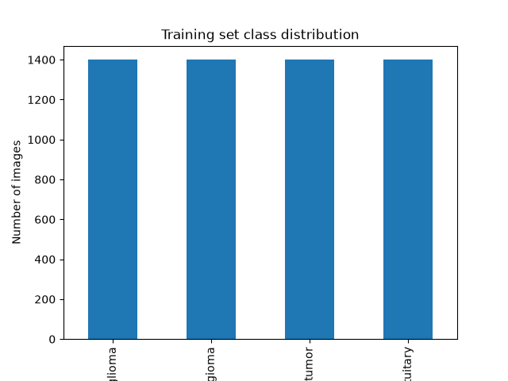
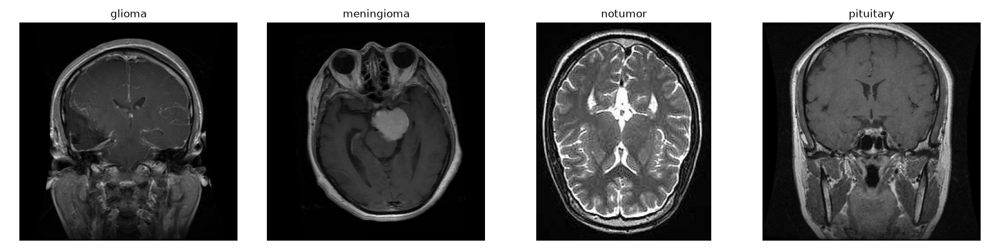

# Week 1 Report

## Goals for this week
- Set up project environment and repo
- Download and verify dataset
- Explore data visually

## What I did (day by day)

**Day 1** — Set up the project repository structure (data, src, notebooks,
models, app, reports, tests folders). Created `.gitignore` and
`requirements.txt`.

**Day 2** — Downloaded the Brain Tumor MRI Dataset manually from Kaggle
(4 classes: glioma, meningioma, pituitary, notumor). Reorganized it into
`data/raw/Training` and `data/raw/Testing`.

**Day 3** — Created a Python virtual environment and installed project
dependencies via `requirements.txt`.

**Day 4** — Wrote `src/data_loader.py` to scan the dataset folders and
build a table of image filepaths and labels. Confirmed the dataset:
5,600 training images and 1,600 testing images, perfectly balanced across
all four classes (1,400 images each).

**Day 5** — Created a GitHub repository and connected it to the local
project. Resolved a merge conflict caused by an auto-generated LICENSE
file on GitHub, using `git pull --allow-unrelated-histories`.

**Day 6** — Evaluated two approaches for exploratory data analysis:
Jupyter notebooks versus standalone Python scripts. Selected the script-based
approach for this project, as it integrates more reliably with the existing
virtual environment setup and keeps the development workflow consistent
across all stages of the pipeline.

**Day 7** — Wrote `src/eda.py` to explore the dataset: plotted the class
distribution, viewed sample MRI images from each class, and checked image
dimensions across a random sample. Saved the generated charts to `reports/`.

## Key findings

- Dataset: 5,600 training images / 1,600 testing images
- Classes: glioma, meningioma, pituitary, notumor — perfectly balanced
  (1,400 images per class in training)
- Image shapes: _(fill in — run `python src/eda.py` and check the printed
  "Sample image shapes" section; note whether all 10 samples were the same
  size or varied)_
- Visual observation: _(fill in — after looking at `reports/sample_images.png`,
  could you visually tell tumor vs. no-tumor apart? Any pattern you noticed —
  e.g. tumors appearing as bright/dark irregular regions?)_

**Class distribution:**

**Sample images per class:**

## Problems faced & how I solved them

- **PowerShell vs. Linux command syntax** — initial `mkdir -p` / `mv`
  commands failed since they're Linux/Mac syntax; switched to PowerShell
  equivalents (`New-Item`, `Move-Item`).
- **Interrupted pip install** — an early `pip install -r requirements.txt`
  got interrupted mid-download; re-ran it cleanly with the venv active.
- **Git merge conflict** — GitHub auto-generated a LICENSE file that
  didn't exist locally, causing a rejected push; resolved with
  `git pull origin main --allow-unrelated-histories` and completed the merge.
- **Notebook kernel mismatch** — Jupyter notebook was running system Python
  instead of the project venv, causing `ModuleNotFoundError: No module
  named 'cv2'` even though the package was installed correctly in the venv.
  Switched to a plain `.py` script (`src/eda.py`) to avoid the kernel
  selection issue entirely.

## What I'd do differently

_(fill in — a couple of honest reflections, e.g.: would you set up the
venv/kernel connection first before creating the notebook next time?
Would you check PowerShell syntax before running commands? Anything that
took longer than it should have?)_

## Plan for next week

Week 2: build the preprocessing pipeline — train/validation split
(stratified, to preserve class balance), image resizing and normalization,
and a PyTorch `Dataset`/`DataLoader` class to feed images into the model.